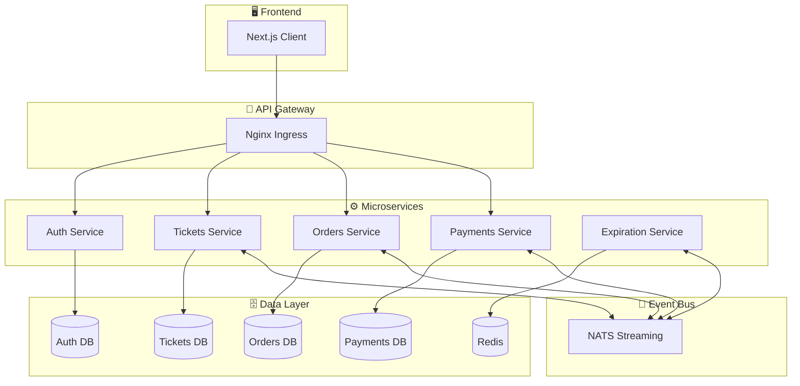
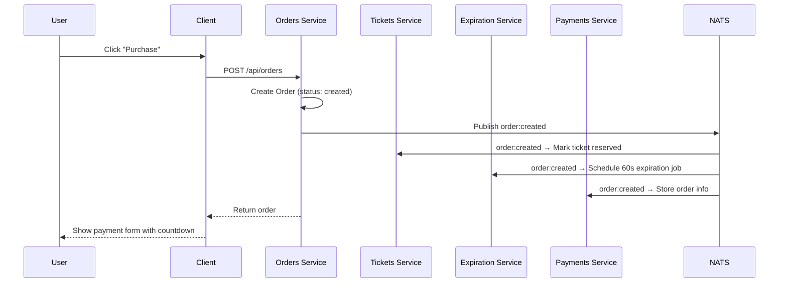
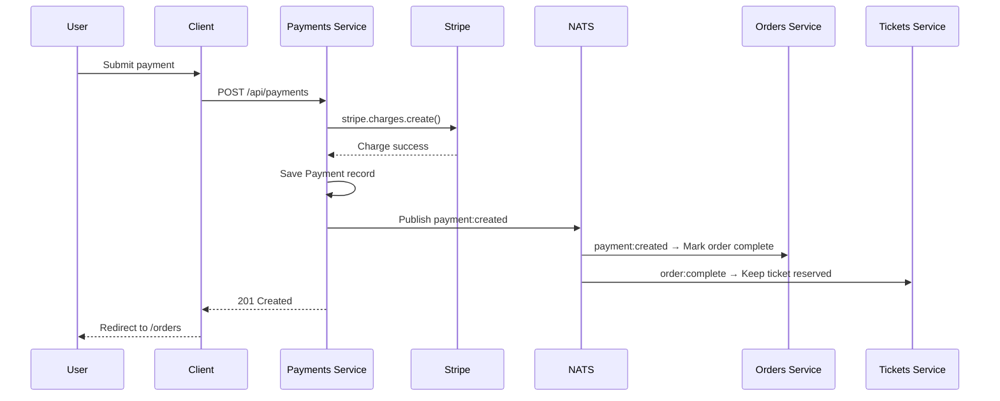
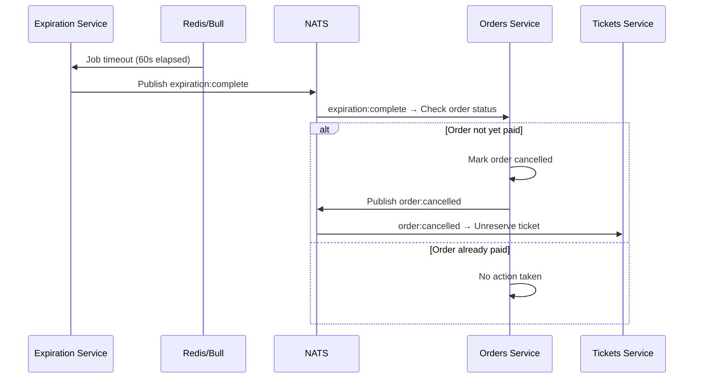

<div align="center">

# 🎭 ShowSphere

**A Production-Ready Event Ticketing Platform Built with Microservices Architecture**

[](https://nodejs.org)
[](https://www.typescriptlang.org)
[](https://react.dev)
[](https://nextjs.org)
[](https://www.mongodb.com)
[](https://redis.io)
[](https://www.docker.com)
[](https://kubernetes.io)
[](https://stripe.com)

[](LICENSE)
[](https://github.com/ankiitsingh21/ShowSphere/actions)
[](CONTRIBUTING.md)

---

[Overview](#-overview) · [Features](#-features) · [Architecture](#-architecture) · [Tech Stack](#-tech-stack) · [Getting Started](#-getting-started) · [API Reference](#-api-reference) · [Testing](#-testing) · [Contributing](#-contributing)

</div>

---

## 📖 Overview

**ShowSphere** is a fully-featured, scalable event ticketing platform that demonstrates battle-tested patterns used in real-world production systems. Built on a **microservices architecture**, it enables users to list, purchase, and manage event tickets with real-time updates and secure payment processing.

The platform is designed around four core engineering principles:

- **Domain-Driven Design** — Each service owns its domain, its database, and its business logic. No shared databases. No tight coupling.
- **Event-Driven Architecture** — Services communicate asynchronously through NATS Streaming, enabling loose coupling and high resilience.
- **Optimistic Concurrency Control** — Version-based locking prevents race conditions when multiple services update shared data simultaneously.
- **Kubernetes-Native Deployment** — The entire platform runs on Kubernetes with Skaffold managing the local development loop.

---

## ✨ Features

<table>
<tr>
<td width="50%" valign="top">

### 👤 User Management
- Secure registration and authentication
- JWT-based session management via cookies
- Password hashing with Node.js `scrypt`
- Stateless auth shared across all services

### 🎟️ Ticket Management
- Create and list tickets for sale
- Real-time availability tracking
- Edit ticket details (price, title)
- Automatic reservation when an order is placed

</td>
<td width="50%" valign="top">

### 📦 Order Processing
- Instant ticket reservation on order creation
- 60-second payment window with countdown timer
- Automatic order expiration via Bull + Redis queues
- Full order history per user

### 💳 Payment System
- Secure Stripe integration (test + production keys)
- Real-time charge processing
- Order automatically completed on payment success
- Cancelled orders release ticket back to market

</td>
</tr>
</table>

### 🏆 Platform Highlights

| Capability | Detail |
|---|---|
| **Microservices** | 5 independently deployable services, each with a dedicated MongoDB instance |
| **Event Bus** | Asynchronous inter-service communication via NATS Streaming |
| **Concurrency Control** | Optimistic locking using version numbers via `updateIfCurrentPlugin` |
| **Shared Library** | `@showsphere/common` — a versioned NPM package consumed by all services |
| **Full Test Coverage** | Jest + Supertest with MongoDB Memory Server for isolated, fast tests |
| **CI/CD** | GitHub Actions pipeline runs tests on every pull request |
| **Production-Ready** | Complete Kubernetes manifests for cluster deployment |

---

## 🏗️ Architecture

### System Diagram

```
┌──────────────────────────────────────────────────────────────────────────────────┐
│                              KUBERNETES CLUSTER                                  │
├──────────────────────────────────────────────────────────────────────────────────┤
│                                                                                  │
│   ┌────────────────────────────────────────────────────────────────────────┐     │
│   │                      NGINX INGRESS CONTROLLER                          │     │
│   │                          (ticketing.dev)                               │     │
│   └──────┬──────────────┬──────────────┬──────────────┬────────────────────┘     │
│          │              │              │              │                           │
│          ▼              ▼              ▼              ▼                           │
│   ┌────────────┐ ┌────────────┐ ┌────────────┐ ┌────────────┐                   │
│   │    AUTH    │ │  TICKETS   │ │   ORDERS   │ │  PAYMENTS  │                   │
│   │  SERVICE   │ │  SERVICE   │ │  SERVICE   │ │  SERVICE   │                   │
│   │/api/users  │ │/api/tickets│ │/api/orders │ │/api/payment│                   │
│   └─────┬──────┘ └─────┬──────┘ └─────┬──────┘ └─────┬──────┘                   │
│         │              │              │              │                           │
│         ▼              ▼              ▼              ▼                           │
│   ┌────────────┐ ┌────────────┐ ┌────────────┐ ┌────────────┐                   │
│   │  MongoDB   │ │  MongoDB   │ │  MongoDB   │ │  MongoDB   │                   │
│   │ (auth-db)  │ │(tickets-db)│ │ (orders-db)│ │(payment-db)│                   │
│   └────────────┘ └────────────┘ └────────────┘ └────────────┘                   │
│                                                                                  │
│   ┌────────────────────────────────────────────────────────────────────────┐     │
│   │                       NATS STREAMING SERVER                            │     │
│   │                   (Event Bus · Cluster: ticketing)                     │     │
│   └──────────────────────────────┬─────────────────────────────────────────┘     │
│                                  │                                               │
│                                  ▼                                               │
│   ┌────────────────────────────────────────────────────────────────────────┐     │
│   │                        EXPIRATION SERVICE                              │     │
│   │                       (Bull Queue + Redis)                             │     │
│   └────────────────────────────────────────────────────────────────────────┘     │
│                                                                                  │
│   ┌────────────────────────────────────────────────────────────────────────┐     │
│   │                       CLIENT (Next.js 16)                              │     │
│   │                      React 19 · Bootstrap 5                            │     │
│   └────────────────────────────────────────────────────────────────────────┘     │
│                                                                                  │
└──────────────────────────────────────────────────────────────────────────────────┘
```

### Service Graph



---

## 🔄 Event Flows

### Order Creation Flow



### Payment Flow



### Order Expiration Flow



---

## 🛠️ Tech Stack

### Backend Services

All services are built with **Node.js + TypeScript** using Express.

| Service | Database | Additional |
|---|---|---|
| **Auth** | MongoDB | scrypt password hashing, JWT |
| **Tickets** | MongoDB | NATS publisher & listener |
| **Orders** | MongoDB | NATS publisher & listener |
| **Payments** | MongoDB | Stripe SDK, NATS publisher & listener |
| **Expiration** | Redis | Bull queue, no HTTP routes |

### Frontend

| Technology | Version | Purpose |
|---|---|---|
| **Next.js** | 16 | SSR React framework |
| **React** | 19 | UI library |
| **Bootstrap** | 5 | Responsive styling |
| **Axios** | Latest | HTTP client (SSR-aware) |
| **react-stripe-checkout** | 2.6 | Stripe payment UI |

### Infrastructure

| Technology | Purpose |
|---|---|
| **Docker** | Containerisation for every service |
| **Kubernetes** | Orchestration — deployments, services, secrets |
| **Skaffold** | Local dev workflow: build → deploy → sync |
| **NATS Streaming** | Persistent, durable event bus |
| **Nginx Ingress** | Routing and load balancing |
| **GitHub Actions** | CI pipeline — runs tests on every PR |

### Shared Library — `@showsphere/common`

The common package is published to NPM and consumed by all backend services. It provides:

```
@showsphere/common
├── errors/
│   ├── BadRequestError          → 400
│   ├── NotAuthorizedError       → 401
│   ├── NotFoundError            → 404
│   ├── RequestValidationError   → 400 (with field details)
│   └── DatabaseConnectionError  → 500
├── middlewares/
│   ├── currentUser              → Decodes JWT from cookie session
│   ├── requireAuth              → Guards authenticated routes
│   ├── errorHandler             → Unified error response format
│   └── validateRequest          → express-validator wrapper
├── events/
│   ├── base-listener.ts         → Abstract NATS listener base class
│   ├── base-publisher.ts        → Abstract NATS publisher base class
│   ├── subjects.ts              → Enum of all event subjects
│   └── [event interfaces]       → Typed event data contracts
├── types/
│   └── OrderStatus              → Enum: created | awaiting:payment | complete | cancelled
└── plugin/
    └── updateIfCurrentPlugin    → Mongoose plugin for optimistic concurrency
```

---

## 📁 Project Structure

```
ShowSphere/
│
├── auth/                          # Authentication Service
│   ├── src/
│   │   ├── routes/
│   │   │   ├── signup.ts          # POST /api/users/signup
│   │   │   ├── signin.ts          # POST /api/users/signin
│   │   │   ├── signout.ts         # POST /api/users/signout
│   │   │   └── current-user.ts    # GET  /api/users/currentuser
│   │   ├── modals/
│   │   │   └── user.ts            # User Mongoose model
│   │   ├── services/
│   │   │   └── password.ts        # scrypt hash + compare
│   │   ├── test/setup.ts
│   │   ├── app.ts
│   │   └── index.ts
│   ├── Dockerfile
│   └── package.json
│
├── tickets/                       # Tickets Service
│   ├── src/
│   │   ├── routes/
│   │   │   ├── new.ts             # POST /api/tickets
│   │   │   ├── show.ts            # GET  /api/tickets/:id
│   │   │   ├── index.ts           # GET  /api/tickets
│   │   │   └── update.ts          # PUT  /api/tickets/:id
│   │   ├── models/ticket.ts
│   │   ├── events/
│   │   │   ├── publishers/        # TicketCreatedPublisher, TicketUpdatedPublisher
│   │   │   └── listeners/         # OrderCreatedListener, OrderCancelledListener
│   │   ├── __mocks__/nats-wrapper.ts
│   │   └── nats-wrapper.ts
│   ├── Dockerfile
│   └── package.json
│
├── orders/                        # Orders Service
│   ├── src/
│   │   ├── routes/
│   │   │   ├── new.ts             # POST   /api/orders
│   │   │   ├── show.ts            # GET    /api/orders/:id
│   │   │   ├── index.ts           # GET    /api/orders
│   │   │   └── delete.ts          # DELETE /api/orders/:id
│   │   ├── models/
│   │   │   ├── order.ts           # Order model (with OCC version)
│   │   │   └── ticket.ts          # Ticket replica model
│   │   ├── events/
│   │   │   ├── publishers/        # OrderCreatedPublisher, OrderCancelledPublisher
│   │   │   └── listeners/         # TicketCreated, TicketUpdated, ExpirationComplete, PaymentCreated
│   │   └── nats-wrapper.ts
│   ├── Dockerfile
│   └── package.json
│
├── payments/                      # Payments Service
│   ├── src/
│   │   ├── routes/new.ts          # POST /api/payments
│   │   ├── models/
│   │   │   ├── order.ts           # Order replica model
│   │   │   └── payment.ts         # Payment record model
│   │   ├── events/
│   │   │   ├── publisher/         # PaymentCreatedPublisher
│   │   │   └── listener/          # OrderCreatedListener, OrderCancelledListener
│   │   ├── stripe.ts              # Stripe SDK initialisation
│   │   └── nats-wrapper.ts
│   ├── Dockerfile
│   └── package.json
│
├── expiration/                    # Expiration Service (no HTTP routes)
│   ├── src/
│   │   ├── queues/
│   │   │   └── expiration-queue.ts  # Bull queue — schedules & processes jobs
│   │   ├── events/
│   │   │   ├── listeners/           # OrderCreatedListener → enqueues job
│   │   │   └── publisher/           # ExpirationCompletePublisher
│   │   └── nats-wrapper.ts
│   ├── Dockerfile
│   └── package.json
│
├── client/                        # Next.js Frontend
│   ├── pages/
│   │   ├── index.jsx              # Landing page — ticket listings
│   │   ├── _app.jsx               # App wrapper — fetches currentUser (SSR)
│   │   ├── auth/
│   │   │   ├── signin.jsx
│   │   │   ├── signup.jsx
│   │   │   └── signout.jsx
│   │   ├── tickets/
│   │   │   ├── new.jsx            # Create a ticket
│   │   │   └── [ticketId].jsx     # View ticket + purchase button
│   │   └── orders/
│   │       ├── index.jsx          # My orders list
│   │       └── [orderId].jsx      # Payment page + countdown timer
│   ├── components/header.jsx
│   ├── hooks/use-request.jsx      # Axios wrapper with unified error handling
│   ├── api/build-client.js        # SSR-aware Axios instance (cluster vs browser)
│   └── package.json
│
├── common/                        # Shared NPM Package source
│   └── src/
│       ├── errors/
│       ├── middlewares/
│       ├── events/
│       ├── types/
│       └── plugin/
│
├── infra/k8s/                     # Kubernetes Manifests
│   ├── auth-depl.yaml
│   ├── auth-mongo-depl.yaml
│   ├── tickets-depl.yaml
│   ├── tickets-mongo-depl.yaml
│   ├── orders-depl.yaml
│   ├── orders-mongo-depl.yaml
│   ├── payments-depl.yaml
│   ├── payments-mongo-depl.yaml
│   ├── expiration-depl.yaml
│   ├── expiration-red-depl.yaml
│   ├── nats-depl.yaml
│   ├── client-depl.yaml
│   └── ingress-srv.yaml
│
├── .github/workflows/
│   └── tests.yml                  # CI — runs auth tests on every PR
│
└── skaffold.yaml                  # Local dev build + sync config
```

---

## 🚀 Getting Started

### Prerequisites

| Tool | Version | Install |
|---|---|---|
| Docker Desktop | Latest | [docker.com](https://www.docker.com/products/docker-desktop) |
| Kubernetes | v1.25+ | Enabled inside Docker Desktop |
| Skaffold | v2.0+ | [skaffold.dev](https://skaffold.dev) |
| Node.js | v18+ | [nodejs.org](https://nodejs.org) |
| kubectl | Latest | [kubernetes.io](https://kubernetes.io/docs/tasks/tools/) |

### Installation

#### 1. Clone the Repository

```bash
git clone https://github.com/ankiitsingh21/ShowSphere.git
cd ShowSphere
```

#### 2. Enable Kubernetes in Docker Desktop

```
Docker Desktop → Settings → Kubernetes → Enable Kubernetes → Apply & Restart
```

#### 3. Install NGINX Ingress Controller

```bash
kubectl apply -f https://raw.githubusercontent.com/kubernetes/ingress-nginx/controller-v1.8.2/deploy/static/provider/cloud/deploy.yaml
```

#### 4. Configure Your Hosts File

Add the following line to your hosts file so that `ticketing.dev` resolves to localhost:

| OS | File Path |
|---|---|
| **Windows** | `C:\Windows\System32\drivers\etc\hosts` |
| **macOS / Linux** | `/etc/hosts` |

```
127.0.0.1 ticketing.dev
```

#### 5. Create Kubernetes Secrets

```bash
# JWT signing secret
kubectl create secret generic jwt-secret --from-literal=JWT_KEY=your_super_secret_jwt_key

# Stripe secret key (from your Stripe dashboard)
kubectl create secret generic stripe-secret --from-literal=STRIPE_KEY=sk_test_your_stripe_key
```

#### 6. Start the Application

```bash
skaffold dev
```

Skaffold will build all Docker images, apply the Kubernetes manifests, and watch your source files for live reloading.

#### 7. Open the Application

```
https://ticketing.dev
```

> **Note:** Chrome will show a security warning for the self-signed certificate. Type `thisisunsafe` anywhere on the page to proceed.

---

## 📡 API Reference

### Authentication Service — `/api/users`

| Method | Endpoint | Description | Auth Required |
|---|---|---|---|
| `POST` | `/api/users/signup` | Register a new user | No |
| `POST` | `/api/users/signin` | Sign in and receive a session cookie | No |
| `POST` | `/api/users/signout` | Invalidate the session cookie | No |
| `GET` | `/api/users/currentuser` | Return the currently authenticated user | No |

<details>
<summary><strong>Request / Response Examples</strong></summary>

#### Sign Up

```http
POST /api/users/signup
Content-Type: application/json

{ "email": "user@example.com", "password": "password123" }
```

```json
// 201 Created
{ "id": "64a7b8c9d1e2f3a4b5c6d7e8", "email": "user@example.com" }
```

#### Sign In

```http
POST /api/users/signin
Content-Type: application/json

{ "email": "user@example.com", "password": "password123" }
```

```json
// 200 OK  (also sets Set-Cookie: session=<base64_jwt>)
{ "id": "64a7b8c9d1e2f3a4b5c6d7e8", "email": "user@example.com" }
```

#### Current User

```http
GET /api/users/currentuser
Cookie: session=<jwt_cookie>
```

```json
// 200 OK
{ "currentUser": { "id": "64a7b8c9d1e2f3a4b5c6d7e8", "email": "user@example.com" } }
```

</details>

---

### Tickets Service — `/api/tickets`

| Method | Endpoint | Description | Auth Required |
|---|---|---|---|
| `POST` | `/api/tickets` | Create a new ticket | Yes |
| `GET` | `/api/tickets` | List all unreserved tickets | No |
| `GET` | `/api/tickets/:id` | Get a single ticket by ID | No |
| `PUT` | `/api/tickets/:id` | Update a ticket (owner only, not reserved) | Yes |

<details>
<summary><strong>Request / Response Examples</strong></summary>

#### Create Ticket

```http
POST /api/tickets
Content-Type: application/json
Cookie: session=<jwt_cookie>

{ "title": "Ed Sheeran Live", "price": 149.99 }
```

```json
// 201 Created
{
  "id": "64a7b8c9d1e2f3a4b5c6d7e8",
  "title": "Ed Sheeran Live",
  "price": 149.99,
  "userId": "64a7b8c9d1e2f3a4b5c6d7e9",
  "version": 0
}
```

#### List Tickets

```http
GET /api/tickets
```

```json
// 200 OK — only tickets where orderId is undefined (unreserved)
[
  { "id": "...", "title": "Ed Sheeran Live", "price": 149.99, "userId": "...", "version": 0 }
]
```

#### Update Ticket

```http
PUT /api/tickets/:id
Content-Type: application/json
Cookie: session=<jwt_cookie>

{ "title": "Ed Sheeran Live — FLOOR", "price": 199.99 }
```

```json
// 200 OK
{ "id": "...", "title": "Ed Sheeran Live — FLOOR", "price": 199.99, "version": 1 }
```

> Returns `400 Bad Request` if the ticket is already reserved by an active order.

</details>

---

### Orders Service — `/api/orders`

| Method | Endpoint | Description | Auth Required |
|---|---|---|---|
| `POST` | `/api/orders` | Create a new order (reserves the ticket) | Yes |
| `GET` | `/api/orders` | List all orders for the current user | Yes |
| `GET` | `/api/orders/:id` | Get a single order by ID | Yes |
| `DELETE` | `/api/orders/:id` | Cancel an order (owner only) | Yes |

<details>
<summary><strong>Request / Response Examples</strong></summary>

#### Create Order

```http
POST /api/orders
Content-Type: application/json
Cookie: session=<jwt_cookie>

{ "ticketId": "64a7b8c9d1e2f3a4b5c6d7e8" }
```

```json
// 201 Created
{
  "id": "64a7b8c9d1e2f3a4b5c6d7f0",
  "status": "created",
  "expiresAt": "2024-01-15T10:31:00.000Z",
  "ticket": {
    "id": "64a7b8c9d1e2f3a4b5c6d7e8",
    "title": "Ed Sheeran Live",
    "price": 149.99
  },
  "userId": "64a7b8c9d1e2f3a4b5c6d7e9",
  "version": 0
}
```

> Returns `400 Bad Request` if the ticket is already reserved.

#### Cancel Order

```http
DELETE /api/orders/:id
Cookie: session=<jwt_cookie>
```

```
// 204 No Content
```

</details>

---

### Payments Service — `/api/payments`

| Method | Endpoint | Description | Auth Required |
|---|---|---|---|
| `POST` | `/api/payments` | Process a Stripe payment for an order | Yes |

<details>
<summary><strong>Request / Response Examples</strong></summary>

#### Create Payment

```http
POST /api/payments
Content-Type: application/json
Cookie: session=<jwt_cookie>

{ "token": "tok_visa", "orderId": "64a7b8c9d1e2f3a4b5c6d7f0" }
```

```json
// 201 Created
{ "id": "64a7b8c9d1e2f3a4b5c6d7f1" }
```

> Returns `400 Bad Request` if the order is already cancelled.  
> Returns `401 Not Authorized` if the order belongs to a different user.

</details>

---

## 📨 Event Catalogue

All inter-service communication flows through NATS Streaming. Every event has a typed interface defined in `@showsphere/common`.

| Subject | Publisher | Subscribers | Purpose |
|---|---|---|---|
| `ticket:created` | Tickets | Orders | Replicate new ticket into Orders DB |
| `ticket:updated` | Tickets | Orders | Sync price/title changes |
| `order:created` | Orders | Tickets, Payments, Expiration | Reserve ticket; store order; schedule expiry |
| `order:cancelled` | Orders | Tickets, Payments | Release ticket reservation |
| `expiration:complete` | Expiration | Orders | Trigger cancellation of unpaid orders |
| `payment:created` | Payments | Orders | Mark order as complete |

---

## 🧪 Testing

Each service has a self-contained test suite using **Jest + Supertest** with an **in-memory MongoDB** instance — no external dependencies required to run tests.

### Running Tests

```bash
# Watch mode (development)
cd auth && npm test

# Single run (CI mode)
cd auth && npm run test:ci
cd tickets && npm run test:ci
cd orders && npm run test:ci
cd payments && npm run test:ci
```

### Test Setup

| Component | Technology |
|---|---|
| **Test Framework** | Jest with `ts-jest` preset |
| **HTTP Assertions** | Supertest |
| **Database** | `mongodb-memory-server` (spins up in-memory MongoDB) |
| **NATS Mocking** | Manual Jest mock in `__mocks__/nats-wrapper.ts` |
| **Auth Simulation** | `global.signin()` helper creates a valid signed JWT cookie |

### What's Tested

- **Auth** — signup, signin, signout, current-user flows; duplicate email rejection; cookie setting
- **Tickets** — CRUD routes; auth guards; optimistic concurrency; event publishing
- **Orders** — creation, retrieval, cancellation; reserved ticket rejection; event publishing
- **Payments** — Stripe charge creation against Stripe test API; payment record persistence; event publishing

### CI Pipeline

The GitHub Actions workflow (`.github/workflows/tests.yml`) runs on every pull request:

```yaml
name: tests
on: pull_request
jobs:
  build:
    runs-on: ubuntu-latest
    steps:
      - uses: actions/checkout@v2
      - run: cd auth && npm install && npm run test:ci
```

> Additional services can be added to the CI matrix by extending `tests.yml`.

---

## 🔐 Environment Variables

All secrets are managed as **Kubernetes Secrets** and injected as environment variables at runtime. Never commit `.env` files.

### Auth Service

| Variable | Source | Description |
|---|---|---|
| `JWT_KEY` | `jwt-secret` K8s secret | Secret key for signing JWTs |
| `MONGO_URI` | Deployment manifest | MongoDB connection string |

### Tickets & Orders Services

| Variable | Source | Description |
|---|---|---|
| `JWT_KEY` | `jwt-secret` K8s secret | Secret key for verifying JWTs |
| `MONGO_URI` | Deployment manifest | MongoDB connection string |
| `NATS_URL` | Deployment manifest | NATS Streaming server URL |
| `NATS_CLUSTER_ID` | Deployment manifest | NATS cluster name (`ticketing`) |
| `NATS_CLIENT_ID` | Pod metadata | Unique client ID (set from `metadata.name`) |

### Payments Service

| Variable | Source | Description |
|---|---|---|
| `JWT_KEY` | `jwt-secret` K8s secret | Secret key for verifying JWTs |
| `MONGO_URI` | Deployment manifest | MongoDB connection string |
| `NATS_URL` | Deployment manifest | NATS Streaming server URL |
| `NATS_CLUSTER_ID` | Deployment manifest | NATS cluster name |
| `NATS_CLIENT_ID` | Pod metadata | Unique client ID |
| `STRIPE_KEY` | `stripe-secret` K8s secret | Stripe secret API key |

### Expiration Service

| Variable | Source | Description |
|---|---|---|
| `NATS_URL` | Deployment manifest | NATS Streaming server URL |
| `NATS_CLUSTER_ID` | Deployment manifest | NATS cluster name |
| `NATS_CLIENT_ID` | Pod metadata | Unique client ID |
| `REDIS_HOST` | Deployment manifest | Redis hostname (`redis-expiration-srv`) |

---

## 🤝 Contributing

Contributions are welcome! Here's how to get involved:

1. **Fork the repository**

2. **Create a feature branch**
   ```bash
   git checkout -b feature/your-amazing-feature
   ```

3. **Make your changes and write tests**

4. **Run the test suite**
   ```bash
   npm run test:ci
   ```

5. **Format your code**
   ```bash
   npm run format
   ```

6. **Commit with a descriptive message**
   ```bash
   git commit -m "feat: add amazing feature"
   ```

7. **Push and open a Pull Request**
   ```bash
   git push origin feature/your-amazing-feature
   ```

### Code Standards

- Follow TypeScript strict mode — no `any` unless genuinely unavoidable
- Write tests for every new route, event listener, and model
- Use `npm run format` (Prettier) before every commit
- Keep commits small and focused — one concern per commit

---

## 🗺️ Roadmap

- [ ] Extend CI to run tests for all services (tickets, orders, payments)
- [ ] User profile management
- [ ] Ticket categories and search/filtering
- [ ] Email notifications on order and payment events
- [ ] Admin dashboard
- [ ] Rate limiting on public endpoints
- [ ] Horizontal pod autoscaling (HPA)
- [ ] Helm charts for production deployment
- [ ] Prometheus metrics + Grafana dashboards
- [ ] Distributed tracing with Jaeger

---

<div align="center">

Made with ❤️ by [Ankit Singh](https://github.com/ankiitsingh21)

[⬆ Back to top](#-showsphere)

</div>
