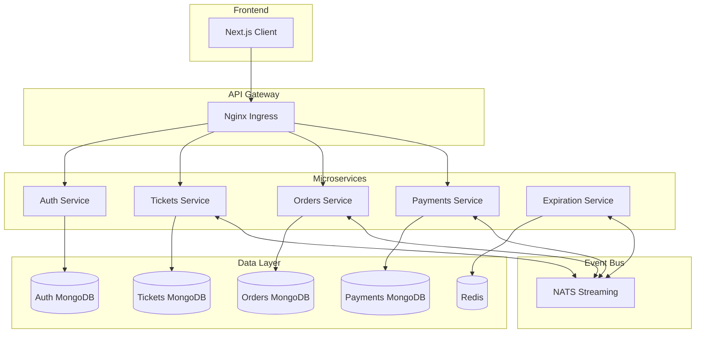
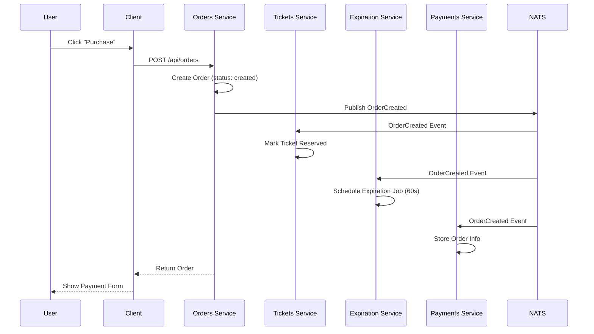
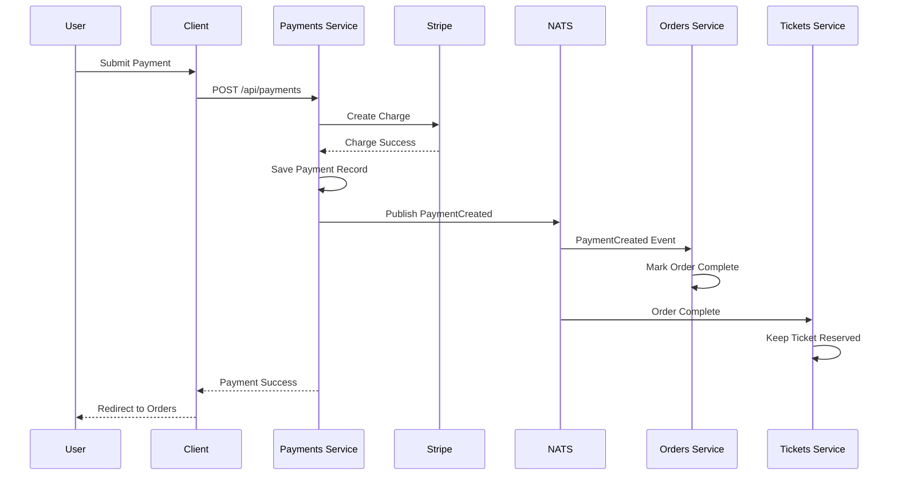
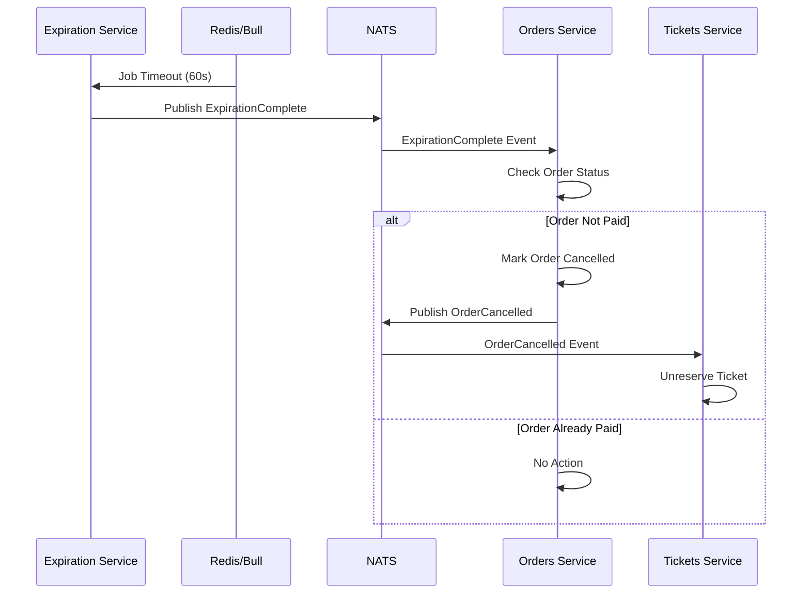

<h1 align="center">ShowSphere</h1>

<p align="center">
  <strong>A Production-Ready Event Ticketing Platform Built with Microservices Architecture</strong>
</p>

<p align="center">
  <a href="#features">Features</a> •
  <a href="#architecture">Architecture</a> •
  <a href="#tech-stack">Tech Stack</a> •
  <a href="#getting-started">Getting Started</a> •
  <a href="#api-reference">API Reference</a> •
  <a href="#contributing">Contributing</a>
</p>

<p align="center">
  
  
  
  
  
  
  
  
  
</p>

<p align="center">
  
  
  
</p>

---

## Overview

**ShowSphere** is a fully-featured, scalable event ticketing platform that demonstrates modern software architecture patterns. Built using a **microservices architecture**, it enables users to list, purchase, and manage event tickets with real-time updates and secure payment processing.

This project showcases:
- **Domain-Driven Design** with isolated, independently deployable services
- **Event-Driven Architecture** using NATS Streaming for asynchronous communication
- **Optimistic Concurrency Control** to handle race conditions
- **Kubernetes Orchestration** for container management and scaling

---

## Features

<table>
<tr>
<td width="50%">

### User Management
- Secure user registration and authentication
- JWT-based session management
- Cookie-based token storage
- Password hashing with scrypt

### Ticket Management
- Create and list tickets for sale
- Real-time ticket availability
- Edit/update ticket details
- Automatic reservation on order

</td>
<td width="50%">

### Order Processing
- Instant ticket reservation
- 60-second payment window
- Automatic order expiration
- Order history tracking

### Payment System
- Secure Stripe integration
- Real-time payment processing
- Order completion on success
- Payment failure handling

</td>
</tr>
</table>

### Additional Highlights

| Feature | Description |
|---------|-------------|
| **Microservices** | 5 independent services with dedicated databases |
| **Event-Driven** | Asynchronous communication via NATS Streaming |
| **Concurrency Control** | Optimistic locking with version numbers |
| **Shared Library** | `@showsphere/common` NPM package |
| **Full Testing** | Jest + Supertest with in-memory MongoDB |
| **CI/CD Ready** | GitHub Actions workflow for automated testing |
| **Production Ready** | Kubernetes manifests for deployment |

---

## Architecture

### System Overview

```
┌─────────────────────────────────────────────────────────────────────────────────┐
│                              KUBERNETES CLUSTER                                 │
├─────────────────────────────────────────────────────────────────────────────────┤
│                                                                                 │
│  ┌───────────────────────────────────────────────────────────────────────────┐  │
│  │                        NGINX INGRESS CONTROLLER                           │  │
│  │                            (ticketing.dev)                                │  │
│  └──────┬─────────────────┬─────────────────┬─────────────────┬──────────────┘  │
│         │                 │                 │                 │                 │
│         ▼                 ▼                 ▼                 ▼                 │
│  ┌─────────────┐   ┌─────────────┐   ┌─────────────┐   ┌─────────────┐          │
│  │    AUTH     │   │   TICKETS   │   │   ORDERS    │   │  PAYMENTS   │          │
│  │   SERVICE   │   │   SERVICE   │   │   SERVICE   │   │   SERVICE   │          │
│  │ /api/users  │   │ /api/tickets│   │ /api/orders │   │/api/payments│          │
│  └──────┬──────┘   └──────┬──────┘   └──────┬──────┘   └──────┬──────┘          │
│         │                 │                 │                 │                 │
│         ▼                 ▼                 ▼                 ▼                 │
│  ┌─────────────┐   ┌─────────────┐   ┌─────────────┐   ┌─────────────┐          │
│  │   MongoDB   │   │   MongoDB   │   │   MongoDB   │   │   MongoDB   │          │
│  │  (auth-db)  │   │(tickets-db) │   │ (orders-db) │   │(payments-db)│          │
│  └─────────────┘   └─────────────┘   └─────────────┘   └─────────────┘          │
│                                                                                 │
│  ┌───────────────────────────────────────────────────────────────────────────┐  │
│  │                         NATS STREAMING SERVER                             │  │
│  │                     (Event Bus - Cluster: ticketing)                      │  │
│  └─────────────────────────────────┬─────────────────────────────────────────┘  │
│                                    │                                            │
│                                    ▼                                            │
│  ┌───────────────────────────────────────────────────────────────────────────┐  │
│  │                          EXPIRATION SERVICE                               │  │
│  │                         (Bull Queue + Redis)                              │  │
│  └───────────────────────────────────────────────────────────────────────────┘  │
│                                                                                 │
│  ┌───────────────────────────────────────────────────────────────────────────┐  │
│  │                          CLIENT (Next.js 16)                              │  │
│  │                         React 19 + Bootstrap 5                            │  │
│  └───────────────────────────────────────────────────────────────────────────┘  │
│                                                                                 │
└─────────────────────────────────────────────────────────────────────────────────┘
```

### Microservices Overview



---

## Event Flow

### Order Creation Flow



### Payment Flow



### Order Expiration Flow



---

## Tech Stack

<table>
<tr>
<td width="33%">

### Backend Services
| Service | Stack |
|---------|-------|
| **Auth** | Express, MongoDB |
| **Tickets** | Express, MongoDB |
| **Orders** | Express, MongoDB |
| **Payments** | Express, MongoDB, Stripe |
| **Expiration** | Bull, Redis |

*All services built with Node.js + TypeScript*

</td>
<td width="33%">

### Frontend
| Technology | Purpose |
|------------|---------|
| **Next.js 16** | SSR Framework |
| **React 19** | UI Library |
| **Bootstrap 5** | Styling |
| **Axios** | HTTP Client |
| **Stripe.js** | Payments UI |

</td>
<td width="33%">

### Infrastructure
| Technology | Purpose |
|------------|---------|
| **Docker** | Containers |
| **Kubernetes** | Orchestration |
| **Skaffold** | Dev Workflow |
| **NATS Streaming** | Event Bus |
| **Nginx Ingress** | Routing |
| **GitHub Actions** | CI/CD |

</td>
</tr>
</table>

### Shared Library (`@showsphere/common`)

```
@showsphere/common
├── errors/          → BadRequestError, NotFoundError, NotAuthorizedError, etc.
├── middlewares/     → currentUser, requireAuth, errorHandler, validateRequest
├── events/          → Base Publisher/Listener, Event interfaces
├── types/           → OrderStatus enum, TypeScript interfaces
└── plugin/          → updateIfCurrentPlugin (Optimistic Concurrency)
```

---

## Project Structure

```
ShowSphere/
│
├── 📁 auth/                      # Authentication Service
│   └── src/
│       ├── routes/               # signup, signin, signout, current-user
│       ├── models/               # User model
│       ├── services/             # Password hashing (scrypt)
│       └── test/                 # Jest test setup
│
├── 📁 tickets/                   # Tickets Service
│   └── src/
│       ├── routes/               # CRUD endpoints
│       ├── models/               # Ticket model
│       ├── events/
│       │   ├── publishers/       # TicketCreated, TicketUpdated
│       │   └── listeners/        # OrderCreated, OrderCancelled
│       └── __mocks__/            # NATS wrapper mock
│
├── 📁 orders/                    # Orders Service
│   └── src/
│       ├── routes/               # new, show, index, delete
│       ├── models/               # Order, Ticket (replica)
│       └── events/
│           ├── publishers/       # OrderCreated, OrderCancelled
│           └── listeners/        # TicketCreated, TicketUpdated, ExpirationComplete, PaymentCreated
│
├── 📁 payments/                  # Payments Service
│   └── src/
│       ├── routes/               # POST /api/payments
│       ├── models/               # Order, Payment
│       ├── events/               # PaymentCreated publisher
│       └── stripe.ts             # Stripe SDK config
│
├── 📁 expiration/                # Expiration Service
│   └── src/
│       ├── queues/               # Bull queue setup
│       ├── events/               # OrderCreated listener, ExpirationComplete publisher
│       └── nats-wrapper.ts
│
├── 📁 client/                    # Next.js Frontend
│   ├── pages/
│   │   ├── auth/                 # signin, signup, signout
│   │   ├── tickets/              # new, [ticketId]
│   │   └── orders/               # [orderId]
│   ├── components/               # Header, etc.
│   ├── hooks/                    # useRequest
│   └── api/                      # buildClient (SSR axios)
│
├── 📁 common/                    # Shared NPM Package
│   └── src/
│       ├── errors/               # Custom error classes
│       ├── middlewares/          # Express middlewares
│       ├── events/               # Event base classes & interfaces
│       ├── types/                # Shared types
│       └── plugin/               # Mongoose plugins
│
├── 📁 infra/k8s/                 # Kubernetes Manifests
│   ├── auth-depl.yaml            # Auth deployment + service
│   ├── auth-mongo-depl.yaml      # Auth MongoDB
│   ├── tickets-depl.yaml         # Tickets deployment + service
│   ├── tickets-mongo-depl.yaml   # Tickets MongoDB
│   ├── orders-depl.yaml          # Orders deployment + service
│   ├── orders-mongo-depl.yaml    # Orders MongoDB
│   ├── payments-depl.yaml        # Payments deployment + service
│   ├── payments-mongo-depl.yaml  # Payments MongoDB
│   ├── expiration-depl.yaml      # Expiration deployment
│   ├── expiration-redis-depl.yaml# Redis for Bull
│   ├── nats-depl.yaml            # NATS Streaming
│   ├── client-depl.yaml          # Next.js client
│   └── ingress-srv.yaml          # Nginx Ingress rules
│
├── 📁 .github/workflows/
│   └── tests.yml                 # CI pipeline
│
└── skaffold.yaml                 # Local dev config
```

---

## Getting Started

### Prerequisites

| Tool | Version | Purpose |
|------|---------|---------|
| [Docker Desktop](https://www.docker.com/products/docker-desktop) | Latest | Container runtime |
| [Kubernetes](https://kubernetes.io/) | v1.25+ | Container orchestration |
| [Skaffold](https://skaffold.dev/) | v2.0+ | Development workflow |
| [Node.js](https://nodejs.org/) | v18+ | JavaScript runtime |
| [kubectl](https://kubernetes.io/docs/tasks/tools/) | Latest | Kubernetes CLI |

### Installation

**1. Clone the Repository**
```bash
git clone https://github.com/ankiitsingh21/ShowSphere.git
cd ShowSphere
```

**2. Enable Kubernetes**
```
Docker Desktop → Settings → Kubernetes → Enable Kubernetes
```

**3. Install NGINX Ingress Controller**
```bash
kubectl apply -f https://raw.githubusercontent.com/kubernetes/ingress-nginx/controller-v1.8.2/deploy/static/provider/cloud/deploy.yaml
```

**4. Configure Host File**

| OS | File Path |
|----|-----------|
| Windows | `C:\Windows\System32\drivers\etc\hosts` |
| Mac/Linux | `/etc/hosts` |

Add this line:
```
127.0.0.1 ticketing.dev
```

**5. Create Kubernetes Secrets**
```bash
# JWT Secret
kubectl create secret generic jwt-secret --from-literal=JWT_KEY=your_jwt_secret_key

# Stripe Secret
kubectl create secret generic stripe-secret --from-literal=STRIPE_KEY=your_stripe_secret_key
```

**6. Start the Application**
```bash
skaffold dev
```

**7. Access the Application**
```
https://ticketing.dev
```

> **Note:** Type `thisisunsafe` in Chrome to bypass the self-signed certificate warning.

---

## API Reference

### Authentication Service

| Method | Endpoint | Description | Auth |
|--------|----------|-------------|------|
| `POST` | `/api/users/signup` | Register new user | No |
| `POST` | `/api/users/signin` | Sign in user | No |
| `POST` | `/api/users/signout` | Sign out user | No |
| `GET` | `/api/users/currentuser` | Get current user | No |

<details>
<summary><strong>Request/Response Examples</strong></summary>

#### Sign Up
```http
POST /api/users/signup
Content-Type: application/json

{ "email": "test@test.com", "password": "password123" }
```

**Response (201):**
```json
{ "id": "64a7b8c9d1e2f3a4b5c6d7e8", "email": "test@test.com" }
```

#### Sign In
```http
POST /api/users/signin
Content-Type: application/json

{ "email": "test@test.com", "password": "password123" }
```

**Response (200):**
```json
{ "id": "64a7b8c9d1e2f3a4b5c6d7e8", "email": "test@test.com" }
```

</details>

---

### Tickets Service

| Method | Endpoint | Description | Auth |
|--------|----------|-------------|------|
| `POST` | `/api/tickets` | Create new ticket | Yes |
| `GET` | `/api/tickets` | List all tickets | No |
| `GET` | `/api/tickets/:id` | Get ticket by ID | No |
| `PUT` | `/api/tickets/:id` | Update ticket | Yes |

<details>
<summary><strong>Request/Response Examples</strong></summary>

#### Create Ticket
```http
POST /api/tickets
Content-Type: application/json
Cookie: session=<jwt_cookie>

{ "title": "Concert Ticket", "price": 99.99 }
```

**Response (201):**
```json
{
  "id": "64a7b8c9d1e2f3a4b5c6d7e8",
  "title": "Concert Ticket",
  "price": 99.99,
  "userId": "64a7b8c9d1e2f3a4b5c6d7e9",
  "version": 0
}
```

</details>

---

### Orders Service

| Method | Endpoint | Description | Auth |
|--------|----------|-------------|------|
| `POST` | `/api/orders` | Create new order | Yes |
| `GET` | `/api/orders` | List user's orders | Yes |
| `GET` | `/api/orders/:id` | Get order by ID | Yes |
| `DELETE` | `/api/orders/:id` | Cancel order | Yes |

<details>
<summary><strong>Request/Response Examples</strong></summary>

#### Create Order
```http
POST /api/orders
Content-Type: application/json
Cookie: session=<jwt_cookie>

{ "ticketId": "64a7b8c9d1e2f3a4b5c6d7e8" }
```

**Response (201):**
```json
{
  "id": "64a7b8c9d1e2f3a4b5c6d7f0",
  "status": "created",
  "expiresAt": "2024-01-15T10:31:00.000Z",
  "ticket": { "id": "64a7b8c9d1e2f3a4b5c6d7e8", "title": "Concert Ticket", "price": 99.99 },
  "userId": "64a7b8c9d1e2f3a4b5c6d7e9",
  "version": 0
}
```

</details>

---

### Payments Service

| Method | Endpoint | Description | Auth |
|--------|----------|-------------|------|
| `POST` | `/api/payments` | Process payment | Yes |

<details>
<summary><strong>Request/Response Examples</strong></summary>

#### Create Payment
```http
POST /api/payments
Content-Type: application/json
Cookie: session=<jwt_cookie>

{ "token": "tok_visa", "orderId": "64a7b8c9d1e2f3a4b5c6d7f0" }
```

**Response (201):**
```json
{ "id": "64a7b8c9d1e2f3a4b5c6d7f1" }
```

</details>

---

## Event Types

| Event | Publisher | Subscribers | Purpose |
|-------|-----------|-------------|---------|
| `ticket:created` | Tickets | Orders | Sync ticket data |
| `ticket:updated` | Tickets | Orders | Sync ticket updates |
| `order:created` | Orders | Tickets, Payments, Expiration | Reserve ticket, process payment |
| `order:cancelled` | Orders | Tickets, Payments | Release ticket reservation |
| `expiration:complete` | Expiration | Orders | Trigger order cancellation |
| `payment:created` | Payments | Orders | Mark order as complete |

---

## Testing

Each service includes a comprehensive test suite using Jest and Supertest with an in-memory MongoDB instance.

### Running Tests

```bash
# Run tests for a specific service
cd auth && npm test

# Run tests in CI mode (single run)
cd auth && npm run test:ci

# Run all service tests
cd auth && npm run test:ci
cd tickets && npm run test:ci
cd orders && npm run test:ci
cd payments && npm run test:ci
```

### Test Configuration

| Component | Technology |
|-----------|------------|
| Test Framework | Jest + ts-jest |
| HTTP Testing | Supertest |
| Database | MongoDB Memory Server |
| Mocking | Jest mocks for NATS |

---

## Environment Variables

### Auth Service
| Variable | Description |
|----------|-------------|
| `JWT_KEY` | Secret key for JWT signing |
| `MONGO_URI` | MongoDB connection string |

### Tickets / Orders Service
| Variable | Description |
|----------|-------------|
| `JWT_KEY` | Secret key for JWT signing |
| `MONGO_URI` | MongoDB connection string |
| `NATS_URL` | NATS Streaming server URL |
| `NATS_CLUSTER_ID` | NATS cluster identifier |
| `NATS_CLIENT_ID` | NATS client identifier |

### Payments Service
| Variable | Description |
|----------|-------------|
| `JWT_KEY` | Secret key for JWT signing |
| `MONGO_URI` | MongoDB connection string |
| `NATS_URL` | NATS Streaming server URL |
| `NATS_CLUSTER_ID` | NATS cluster identifier |
| `NATS_CLIENT_ID` | NATS client identifier |
| `STRIPE_KEY` | Stripe secret API key |

### Expiration Service
| Variable | Description |
|----------|-------------|
| `NATS_URL` | NATS Streaming server URL |
| `NATS_CLUSTER_ID` | NATS cluster identifier |
| `NATS_CLIENT_ID` | NATS client identifier |
| `REDIS_HOST` | Redis server hostname |

---

## Contributing

Contributions are welcome! Please follow these steps:

1. **Fork the repository**

2. **Create a feature branch**
   ```bash
   git checkout -b feature/amazing-feature
   ```

3. **Make your changes**

4. **Run tests**
   ```bash
   npm run test:ci
   ```

5. **Commit your changes**
   ```bash
   git commit -m "Add amazing feature"
   ```

6. **Push to your branch**
   ```bash
   git push origin feature/amazing-feature
   ```

7. **Open a Pull Request**

### Code Style
- Run `npm run format` before committing
- Follow TypeScript best practices
- Write meaningful commit messages
- Include tests for new features

---

## Roadmap

- [ ] Add user profile management
- [ ] Implement ticket categories
- [ ] Add search and filtering
- [ ] Email notifications
- [ ] Admin dashboard
- [ ] Rate limiting
- [ ] Horizontal pod autoscaling
- [ ] Helm charts for deployment
- [ ] Prometheus metrics
- [ ] Distributed tracing with Jaeger

---

<p align="center">
  Made with ❤️ by <a href="https://github.com/ankiitsingh21">Ankit Singh</a>
</p>

<p align="center">
  <a href="#showsphere">Back to top</a>
</p>
